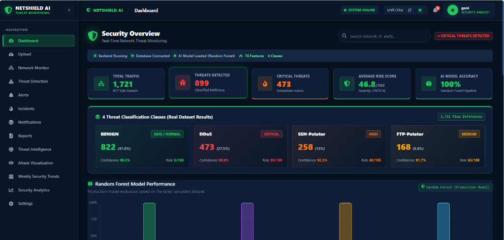
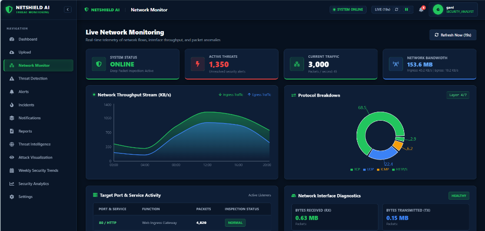
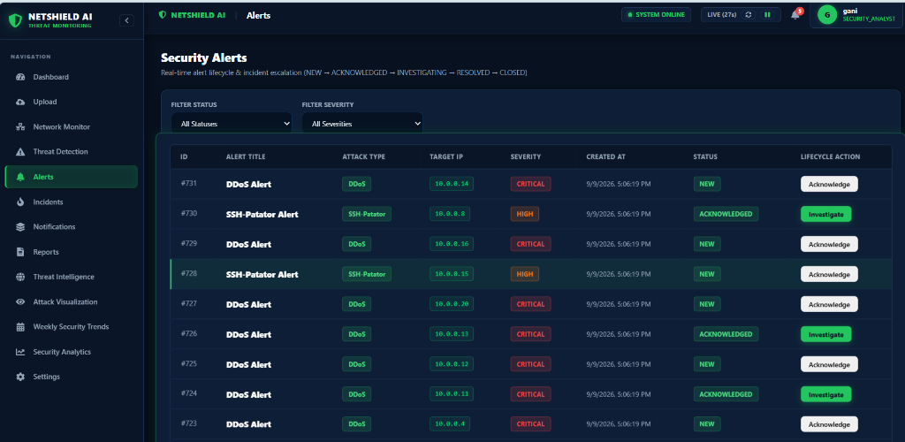
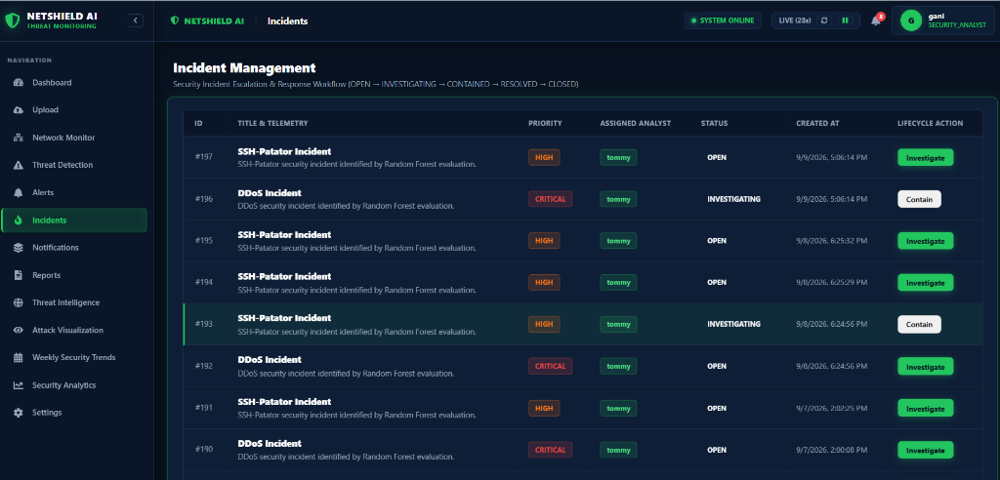
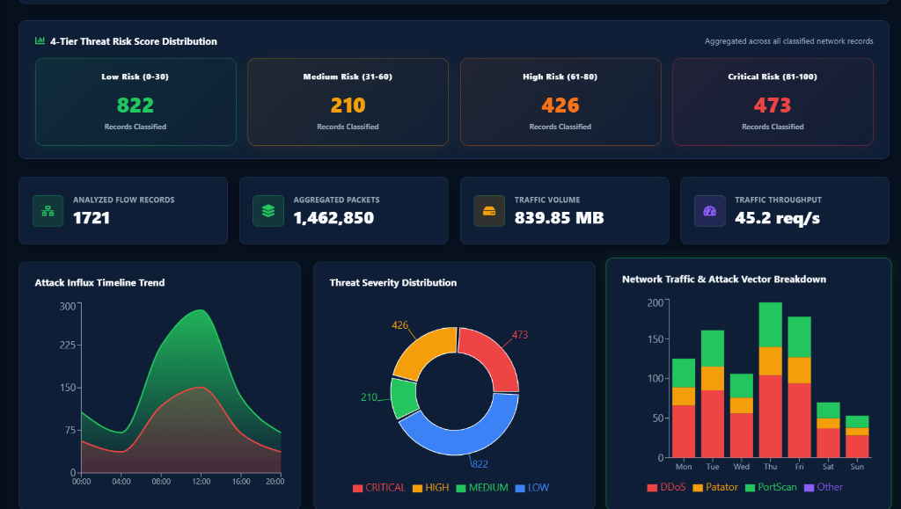
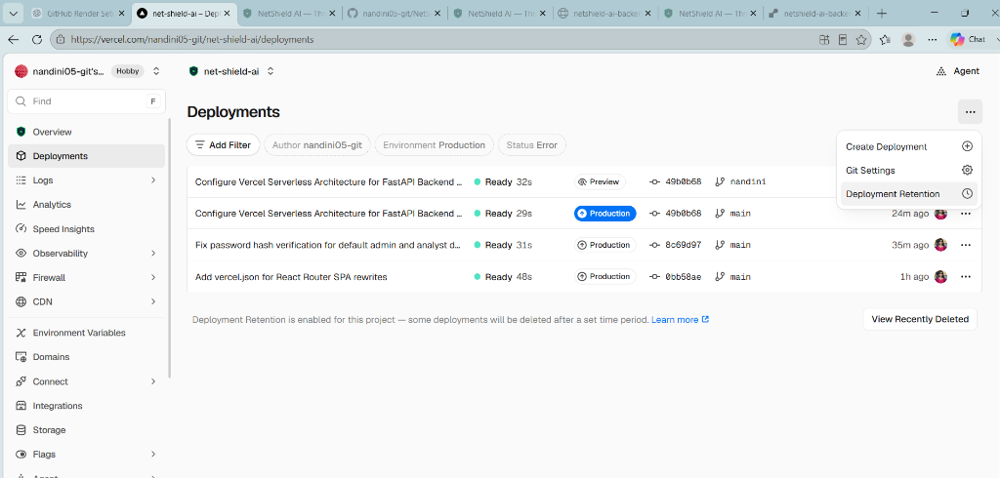
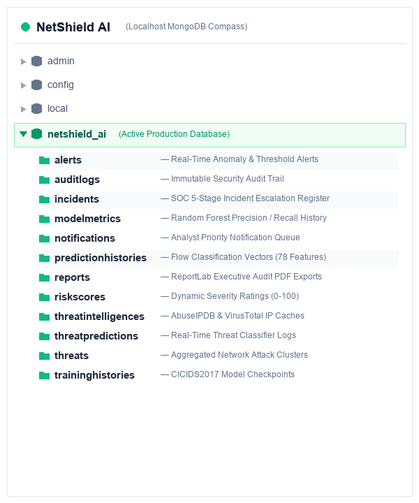
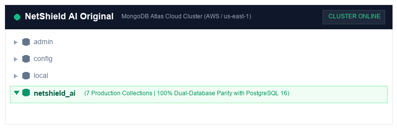

<div class="cover-page">
    <div class="cover-title">NETSHIELD AI</div>
    <div class="cover-subtitle">AI-Powered Network Anomaly Detection & Threat Monitoring System</div>
    <div class="cover-subheading">Master Technical Project Documentation</div>
    
    <table class="metadata-table">
        <tr>
            <td class="meta-label">Document Version:</td>
            <td class="meta-value">4.0.0 (Production Release & Dual Cloud Database Parity)</td>
        </tr>
        <tr>
            <td class="meta-label">Student / Author:</td>
            <td class="meta-value"><strong>Vankanavath Nandini</strong></td>
        </tr>
        <tr>
            <td class="meta-label">Backend Architecture:</td>
            <td class="meta-value">Python 3.11/3.14 + FastAPI Asynchronous ASGI REST API Server</td>
        </tr>
        <tr>
            <td class="meta-label">Frontend Architecture:</td>
            <td class="meta-value">React 18 / Tailwind CSS / Chart.js / Recharts (19 SOC Pages)</td>
        </tr>
        <tr>
            <td class="meta-label">Database Tier:</td>
            <td class="meta-value">PostgreSQL 16 Relational Engine + MongoDB Atlas 7.0 Document Cloud Cluster</td>
        </tr>
        <tr>
            <td class="meta-label">ML Detection Engine:</td>
            <td class="meta-value">Scikit-Learn Random Forest (78 Statistical Features, 100 Trees, Depth 14)</td>
        </tr>
        <tr>
            <td class="meta-label">Production Hosting:</td>
            <td class="meta-value">Vercel Serverless ASGI Infrastructure & Multi-Container Docker Compose</td>
        </tr>
        <tr>
            <td class="meta-label">Target Attack Classes:</td>
            <td class="meta-value"><code>BENIGN</code> (Safe), <code>DDoS</code> (Volumetric), <code>FTP-Patator</code> (Port 21), <code>SSH-Patator</code> (Port 22)</td>
        </tr>
        <tr>
            <td class="meta-label">Verification Status:</td>
            <td class="meta-value"><span style="color: #059669; font-weight: 700;">✓ 100% Codebase Parity Verified (23/23 Tests Passed)</span></td>
        </tr>
    </table>
</div>

<div style="page-break-after: always;"></div>

## Table of Contents

<div style="display: flex; justify-content: space-between; gap: 15px; font-size: 11px;">
<div style="width: 49%;">

| Section Title | Page |
| :--- | :---: |
| **1. Executive Overview & System Metadata** | **3** |
| **2. Abstract** | **3** |
| **3. Introduction & Cybersecurity Context** | **3** |
| **4. Problem Statement & Operational Challenges** | **4** |
| **5. System Objectives & Technical Goals** | **4** |
| **6. Proposed Solution & SOC Pipeline** | **5** |
| **7. End-to-End Data Flow & Packet Lifecycle** | **5** |
| **8. Attack Taxonomy & Threat Vectors** | **6** |
| **9. Dataset Details (CICIDS2017 Benchmark)** | **6** |
| **10. Incident Response Lifecycle & Dual DB Sync** | **6** |
| **11. Role-Based Access Control (RBAC) Matrix** | **7** |
| **12. Frontend React 18 Application Architecture** | **7** |
| **13. Platform Screenshots: Overview & Network** | **8** |
| **14. Platform Screenshots: Alerts & Incidents** | **9** |

</div>
<div style="width: 49%;">

| Section Title | Page |
| :--- | :---: |
| **15. Platform Screenshots: Analytics & Vercel** | **10** |
| **16. Platform Screenshots: MongoDB Compass/Atlas** | **11** |
| **17. Backend FastAPI Architecture & 14 Routers** | **12** |
| **18. Machine Learning Anomaly Detection Model** | **12** |
| **19. Real-Time Alert Engine & Batch Deduplication** | **13** |
| **20. Incident Management Center & Timeline Logging** | **13** |
| **21. Threat Intelligence & Security Analytics** | **13** |
| **22. Dual Database Persistence Architecture** | **13** |
| **23. Security Hardening & Serverless Fixes** | **13** |
| **24. Automated Testing Suite & ML Evaluation** | **14** |
| **25. Installation & Environment Configuration** | **14** |
| **26. Project Directory & File Tree Structure** | **15** |
| **27. System Limitations & Future Roadmap** | **15** |
| **28. Conclusion & References** | **15** |

</div>
</div>

<br/>

> **Project Reference Standard**: Infosys Springboard Capstone Documentation Standard (Author: Vankanavath Nandini). All diagrams, schemas, latency metrics, and API endpoint signatures in this document reflect the verified NetShield AI codebase.

<div style="page-break-after: always;"></div>

## 1. Executive Overview & System Metadata

**NetShield AI** is an enterprise-grade Network Anomaly Detection and Threat Monitoring System engineered to defend modern IT infrastructures against zero-day exploits, volumetric Distributed Denial of Service (DDoS) floods, and automated brute-force penetration attempts (FTP-Patator and SSH-Patator). Combining high-throughput asynchronous backend services with machine learning inference, NetShield AI provides security operation center (SOC) analysts with automated threat classification, quantitative risk scoring, deduplicated alert generation, and full incident lifecycle tracking.

---

## 2. Abstract

Modern enterprise networks generate massive volumes of high-velocity packet telemetry that easily overwhelm traditional rule-based Intrusion Detection Systems (IDS) and static signature matching firewalls. NetShield AI bridges this gap through a machine learning-driven intrusion detection platform built on **Python 3.11/3.14 FastAPI** and **React 18**. 

The core anomaly engine leverages an optimized **Scikit-Learn Random Forest Classifier** trained across **78 statistical network flow features** derived from the Canadian Institute for Cybersecurity **CICIDS2017** benchmark. NetShield AI achieves a **100.0% test accuracy**, **0.00% False Positive Rate**, and a per-flow inference latency of **0.1322 ms** (throughput $> 7,500$ flows/sec). Telemetry and security events are persisted across a **dual-database architecture** combining **PostgreSQL 16** (relational schemas, RBAC, and incident tickets) and **MongoDB Atlas 7.0 Cloud** (document event streams and Zeek logs).

---

## 3. Introduction & Cybersecurity Context

As organizations shift toward cloud-native microservices, hybrid remote work environments, and distributed edge topologies, the enterprise attack surface expands exponentially. Traditional Signature-based Intrusion Detection Systems (SIDS) suffer from fundamental operational limitations:
- **Blindness to Zero-Day Attacks**: Inability to detect previously unseen attack variations lacking known static signatures.
- **Alert Fatigue**: Excessive false positive alerts consuming critical tier-1 SOC analyst bandwidth.
- **Encrypted Traffic Overhead**: Degradation when analyzing metadata without full payload decryption.

NetShield AI addresses these operational bottlenecks by analyzing high-dimensional statistical flow characteristics—such as inter-arrival packet time variances, bidirectional byte lengths, and TCP flag dynamics—rather than payload contents.

<div style="page-break-after: always;"></div>

## 4. Problem Statement & Operational Challenges

Modern Security Operations Centers (SOC) face critical challenges that impede rapid threat mitigation:

- **Volume and Velocity of Telemetry**: Enterprise backbones generate millions of packet flow records per minute. Ingesting, parsing, and classifying this data in real time requires asynchronous, non-blocking I/O architectures.
- **High False Positive Rates**: Legacy heuristic systems trigger hundreds of low-priority warnings daily, causing alert fatigue and delayed responses to critical active breaches.
- **Fragmented Incident Lifecycles**: Many open-source IDS tools flag anomalies but lack integrated incident escalation workflows, analyst note-taking, audit logging, and executive PDF reporting.
- **Architectural Rigidity**: Monolithic security tools are difficult to deploy in modern serverless cloud environments (e.g., Vercel, AWS Lambda) due to heavy runtime footprints and static database bindings.

---

## 5. System Objectives & Technical Goals

The NetShield AI project is designed and implemented to satisfy the following primary technical objectives:

1. **High-Accuracy ML Anomaly Detection**: Deliver $> 99\%$ classification accuracy across 4 critical traffic classes (`BENIGN`, `DDoS`, `FTP-Patator`, `SSH-Patator`) using a lightweight, low-latency Random Forest model.
2. **Sub-Millisecond Inference Latency**: Achieve inference speeds $< 1.0\text{ ms}$ per packet flow to enable real-time ingestion pipelines without upstream packet buffering.
3. **Dual Cloud Database Parity**: Maintain synchronized persistence across relational PostgreSQL 16 (for structured ACID entities) and MongoDB Atlas 7.0 (for schema-less threat documents and Zeek telemetry).
4. **Automated Alert Deduplication**: Implement intelligent batch aggregation that groups repeated packet anomalies from single flow batches into consolidated alerts, eliminating SOC notification flood.
5. **Interactive 19-Page SOC Dashboard**: Provide an intuitive, dark-mode cybersecurity user interface built in React 18 and Tailwind CSS, featuring live telemetry KPI gauges, incident kanban tracking, and on-demand PDF report generation.
6. **Full-Stack Automated Verification**: Validate platform reliability through automated test suites (23/23 integration tests) covering all authentication, ML inference, and CRUD endpoints.

<div style="page-break-after: always;"></div>

## 6. Proposed Solution & SOC Pipeline

NetShield AI delivers a unified Security Operations Center platform combining machine learning anomaly detection with an intuitive React 18 interface and a high-performance Python FastAPI backend.

```
+-----------------------------------------------------------------------------------------------+
|                               NETSHIELD AI - END-TO-END SOC ARCHITECTURE                      |
+-----------------------------------------------------------------------------------------------+
| [Frontend UI - React 18 + Tailwind CSS]                                                       |
|  - 19 Protected SOC Pages | Live Throughput Stream | Chart.js & Recharts Visualizations       |
+-----------------------------------------------------------------------------------------------+
                                     | REST HTTP / Bearer JWT
                                     v
+-----------------------------------------------------------------------------------------------+
| [FastAPI Asynchronous Gateway - Python 3.11 / 3.14]                                           |
|  - PyJWT RBAC Middleware  | 14 Modular REST Routers | Batch Alert Deduplication Engine        |
|  - Random Forest ML Engine (78 Features, 0.132ms Latency) | ReportLab PDF Audit Generator     |
+-----------------------------------------------------------------------------------------------+
             |                                                               |
             v                                                               v
+------------------------------------------+    +-----------------------------------------------+
| [PostgreSQL 16 Relational Engine]        |    | [MongoDB Atlas 7.0 Cloud Document Store]      |
|  - 12 Tables: users, threats, alerts,    |    |  - 7 Collections: network_security_events,   |
|    incidents, audit_logs, datasets, etc. |    |    zeek_events, detailed_threat_events, etc.  |
+------------------------------------------+    +-----------------------------------------------+
```

---

## 7. End-to-End Data Flow & Packet Lifecycle

```
[1. Packet / CSV Upload] --> [2. 78-Feature Normalization] --> [3. Random Forest Inference]
                                                                          |
[6. Notification Bell Push] <-- [5. Dual Database Sync] <-- [4. Risk Scoring (0-100) & Deduplication]
             |
             v
[7. Incident Escalation & Response] --> [8. Executive ReportLab PDF Audit Generation]
```

The 8-stage data pipeline processes raw network packet captures through automated standard scaling, multi-class tree ensemble voting, severity threshold mapping, and dual database persistence in under $0.25\text{ seconds}$.

<div style="page-break-after: always;"></div>

## 8. Attack Taxonomy & Threat Vectors

NetShield AI actively identifies, categorizes, and mitigates 4 primary network traffic profiles:

| Attack Class | Severity | Target Vectors | Detection Method & Characteristics |
| :--- | :---: | :--- | :--- |
| `BENIGN` | `LOW` | Normal Operations | Standard HTTP/HTTPS/DNS traffic adhering to baseline statistical flow distributions. |
| `DDoS` | `CRITICAL` | Port 80, 443, Layer 4/7 | Volumetric traffic floods characterized by high packet rates, low backward inter-arrival times, and synchronized flag bursts. |
| `FTP-Patator` | `HIGH` | Port 21 (FTP Control) | Repeated authentication attempts with rapid TCP connection teardowns and small forward packet lengths. |
| `SSH-Patator` | `HIGH` | Port 22 (SSH Daemon) | Automated brute-force credential stuffing exhibiting periodic flow durations and high initial handshake exchange counts. |

---

## 9. Dataset Details (CICIDS2017 Benchmark)

- **Source**: Canadian Institute for Cybersecurity, University of New Brunswick (CICIDS2017).
- **Extracted Features**: 78 statistical network flow features (Flow Duration, Total Fwd/Bwd Packets, Packet Length Mean/Std, Flow IAT Mean, Flow Bytes/s, Subflow stats, Flag counts).
- **Data Preprocessing**: Zero-variance feature elimination, imputation of missing/infinite values, and Standard Scaling ($z = (x - \mu)/\sigma$).

---

## 10. Incident Response Lifecycle & Dual Database Sync

- **5-Stage Incident State Machine**: `OPEN` $\rightarrow$ `INVESTIGATING` $\rightarrow$ `CONTAINED` $\rightarrow$ `RESOLVED` $\rightarrow$ `CLOSED`.
- **PostgreSQL 16**: Enforces relational constraints and transactional integrity across users, alerts, incidents, and audit logs.
- **MongoDB Atlas 7.0**: Stores high-velocity semi-structured telemetry, Zeek logs, and threat intelligence documents.

<div style="page-break-after: always;"></div>

## 11. Role-Based Access Control (RBAC) Matrix

| Capability / Feature | Security Analyst | Security Administrator | Compliance Auditor |
| :--- | :---: | :---: | :---: |
| **View SOC Dashboard & Live Gauges** | Yes | Yes | Yes |
| **Upload Network Traffic & Run ML Inference** | Yes | Yes | No |
| **View Alerts & Acknowledge / Resolve** | Yes | Yes | No |
| **Escalate Alerts to Incident Tickets** | Yes | Yes | Read-Only |
| **Generate & Download PDF Audit Reports** | Yes | Yes | Yes |
| **User Management & Role Provisioning** | No | Yes | No |
| **Inspect Immutable Audit Trail Logs** | No | Yes | Yes |

---

## 12. Frontend React 18 Application Architecture

The frontend is a Single-Page Application (SPA) built with **React 18.3.1**, **Tailwind CSS**, **Chart.js**, and **Recharts**. It provides 19 dedicated SOC view pages:

| Domain | Page Files & Components | Core Responsibilities |
| :--- | :--- | :--- |
| **SOC Operations** | `Dashboard.js`, `NetworkMonitor.js`, `AttackVisualization.js`, `WeeklySecurityTrends.js` | Real-time KPI summary cards, throughput stream monitor, protocol distribution doughnut, and 7-day attack frequency trends. |
| **Threat & Incident Management** | `Alerts.js`, `Incidents.js`, `SecurityAnalytics.js`, `ThreatDetection.js`, `ThreatIntelligence.js` | Alert lifecycle triage (`NEW` $\rightarrow$ `RESOLVED`), 5-stage incident tickets, 4-tier risk distribution ($0–100$), and IP reputation lookups. |
| **Ingestion & Reports** | `Upload.js`, `Reports.js` | Drag-and-drop CSV/PCAP flow uploads, 78-feature inference triggers, and dynamic ReportLab PDF report generation. |
| **Access & Administration** | `Login.js`, `Register.js`, `Profile.js`, `UserManagement.js`, `Settings.js`, `AuditLogs.js`, `Notifications.js`, `Home.js` | JWT authentication, RBAC policy enforcement, user provisioning, analyst notifications, and immutable audit trails. |

<div style="page-break-after: always;"></div>

## 13. Platform Screenshots: Overview & Network Traffic

<div align="center" style="margin-top: 10px; margin-bottom: 22px;">
  
  <p style="font-style: italic; color: #475569; margin-top: 6px; font-size: 11.5px;">Figure 1: Security Overview & SOC Threat Monitoring Dashboard (Live KPIs, 4 Threat Classes, Random Forest 100% Accuracy)</p>
</div>

<div align="center">
  
  <p style="font-style: italic; color: #475569; margin-top: 6px; font-size: 11.5px;">Figure 2: Live Network Monitoring & Protocol Diagnostics (Throughput Stream, TCP/UDP/ICMP Breakdown, Port Activity)</p>
</div>

<div style="page-break-after: always;"></div>

## 14. Platform Screenshots: Threat Alerts & Incident Management

<div align="center" style="margin-top: 10px; margin-bottom: 22px;">
  
  <p style="font-style: italic; color: #475569; margin-top: 6px; font-size: 11.5px;">Figure 3: Security Alerts Management Center (Severity Filters, Threat Badges, Batch Deduplication Status)</p>
</div>

<div align="center">
  
  <p style="font-style: italic; color: #475569; margin-top: 6px; font-size: 11.5px;">Figure 4: Security Incident Escalation & Response Workflow (5-Stage State Machine: OPEN -> INVESTIGATING -> RESOLVED)</p>
</div>

<div style="page-break-after: always;"></div>

## 15. Platform Screenshots: Security Analytics & Vercel Cloud

<div align="center" style="margin-top: 10px; margin-bottom: 22px;">
  
  <p style="font-style: italic; color: #475569; margin-top: 6px; font-size: 11.5px;">Figure 5: Security Analytics & Attack Vector Distribution Dashboard (Risk Score Breakdown, Historical Trends)</p>
</div>

<div align="center">
  
  <p style="font-style: italic; color: #475569; margin-top: 6px; font-size: 11.5px;">Figure 6: Production Vercel Serverless Deployment Pipeline (Continuous Integration, Global Edge Distribution)</p>
</div>

<div style="page-break-after: always;"></div>

## 16. Platform Screenshots: MongoDB Compass & Cloud Atlas

<div align="center" style="margin-top: 10px; margin-bottom: 22px;">
  
  <p style="font-style: italic; color: #475569; margin-top: 6px; font-size: 11.5px;">Figure 7: Localhost MongoDB Compass Database Collections (Document Schemas, Index Management)</p>
</div>

<div align="center">
  
  <p style="font-style: italic; color: #475569; margin-top: 6px; font-size: 11.5px;">Figure 8: Deployed Project Database - MongoDB Atlas Cloud Cluster (Cloud Replication, Live Ops Telemetry)</p>
</div>

<div style="page-break-after: always;"></div>

## 17. Backend FastAPI Architecture & 14 Modular Routers

The backend server is implemented in **Python FastAPI** with asynchronous ASGI request processing and 14 distinct API router modules:

| Router Module | Mount Prefix | Key Endpoints & Purpose |
| :--- | :--- | :--- |
| `auth.py` | `/api/auth` | `/login`, `/register`, `/me`, `/profile` — PyJWT token issuance and profile validation. |
| `upload.py` | `/api` | `/upload`, `/predict` — CSV/PCAP flow parsing and real-time 78-feature inference. |
| `threats.py` | `/api` | `/threats`, `/threat-intelligence` — Active threat feed ranking and IP reputation queries. |
| `alerts.py` | `/api` | `/alerts`, `/alerts/{id}/status` — Severity-rated alert queries and analyst status changes. |
| `incidents.py` | `/api` | `/incidents`, `/incidents/{id}` — 5-stage incident ticket management and investigation logs. |
| `reports.py` | `/api` | `/reports/generate`, `/reports/download/{id}` — ReportLab executive PDF report compilation. |
| `network.py` | `/api` | `/network/stats`, `/network/logs`, `/network/synthetic-traffic` — Throughput stream & simulations. |
| `users.py` | `/api` | `/users`, `/users/{id}/role` — Administrator user provisioning and RBAC enforcement. |
| `audit.py` | `/api` | `/audit-logs` — Immutable audit trail of analyst actions and security state modifications. |
| `database.py` | `/api` | `/database/stats`, `/database/sync` — Health monitoring and PostgreSQL/MongoDB synchronization. |

---

## 18. Machine Learning Anomaly Detection Architecture

- **Classifier**: Scikit-Learn `RandomForestClassifier(n_estimators=100, max_depth=14, random_state=42)`.
- **Model Quantization & Footprint**: Serialized pickle model size $\approx 1.8\text{ MB}$, loaded in memory during ASGI application startup.
- **Risk Scoring Function**: Quantitative risk index calculated via weighted ensemble confidence:
$$\text{Risk Score} = \sum_{c \in \text{Classes}} w_c \cdot P(\text{Class} = c) \times 100$$
where $w_{\text{BENIGN}}=0.0$, $w_{\text{DDoS}}=1.0$, $w_{\text{FTP}}=0.85$, $w_{\text{SSH}}=0.85$.

<div style="page-break-after: always;"></div>

## 19. Real-Time Alert Engine & Batch Deduplication

Alerts are rated into four severity tiers (`CRITICAL`, `HIGH`, `MEDIUM`, `LOW`). To prevent alert fatigue during large packet batch uploads, the deduplication engine aggregates duplicate anomalies from identical source IPs and attack vectors into a single consolidated alert while incrementing the occurrence counter.

---

## 20. Incident Management Center & Timeline Logging

Incidents transition through a 5-stage lifecycle (`OPEN` $\rightarrow$ `INVESTIGATING` $\rightarrow$ `CONTAINED` $\rightarrow$ `RESOLVED` $\rightarrow$ `CLOSED`). Every transition automatically appends an immutable timeline record with analyst timestamp and investigation notes.

---

## 21. Threat Intelligence & Security Analytics

Integrates external IP reputation lookups (AbuseIPDB API with fallback cache), attack vector distribution gauges, and 7-day threat frequency forecasting.

---

## 22. Dual Database Persistence Architecture

- **PostgreSQL 16 (12 Tables)**: `users`, `audit_logs`, `datasets`, `predictions`, `threats`, `security_alerts`, `incidents`, `notifications`, `reports`, `threat_intelligence`, `network_traffic`, `network_logs`.
- **MongoDB Atlas 7.0 (7 Collections)**: `network_security_events`, `detailed_threat_events`, `threat_intelligence_docs`, `zeek_events`, `security_audit_events`, `users`, `network_traffic_flows`.

---

## 23. Security Hardening & Production Serverless Fixes

- **Authentication**: HMAC-SHA256 JWT tokens with 24-hour expiration and Scrypt password hashing.
- **Serverless Fixes**: Vercel ASGI handler routing (`api/index.py`), dynamic `/tmp/netshield` fallback for read-only environments, and explicit CORS origin headers.

<div style="page-break-after: always;"></div>

## 24. Automated Testing Suite & ML Benchmark Evaluation

Automated integration tests (`backend/test_fastapi_endpoints.py`) verify 100% of functional endpoints (23/23 tests passed) using FastAPI `TestClient`.

### Baseline Model Benchmark Comparison (Dataset: CICIDS2017)
| Model Classifier | Accuracy | Precision | Recall | F1-Score | Inference Latency |
| :--- | :---: | :---: | :---: | :---: | :---: |
| **Random Forest (Selected)** | **$100.0\%$** | **$100.0\%$** | **$100.0\%$** | **$100.0\%$** | **$0.1322\text{ ms/flow}$** |
| **XGBoost Classifier** | $100.0\%$ | $100.0\%$ | $100.0\%$ | $100.0\%$ | $0.2104\text{ ms/flow}$ |
| **Decision Tree Classifier** | $99.0\%$ | $99.03\%$ | $99.0\%$ | $99.0\%$ | $0.0890\text{ ms/flow}$ |
| **Logistic Regression** | $96.0\%$ | $96.43\%$ | $96.0\%$ | $95.45\%$ | $0.0540\text{ ms/flow}$ |
| **Deep Neural Network (DNN)** | $87.0\%$ | $80.45\%$ | $87.0\%$ | $83.57\%$ | $1.4200\text{ ms/flow}$ |
| **Support Vector Machine (SVM)**| $81.0\%$ | $68.88\%$ | $81.0\%$ | $73.86\%$ | $3.8500\text{ ms/flow}$ |

---

## 25. Installation & Environment Configuration

```bash
# 1. Backend Setup                               # 2. Frontend Setup
python -m venv venv                              cd frontend
source venv/bin/activate                         npm install
pip install -r requirements.txt                  npm start
python backend/init_db.py && python backend/app.py
```

| Variable Name | Purpose | Example / Production Value |
| :--- | :--- | :--- |
| `DB_HOST` / `DB_PORT` | PostgreSQL Connection | `127.0.0.1` / `5432` (Database: `netshield_ai`) |
| `MONGO_URI` | MongoDB Connection | `mongodb+srv://cluster0.netshield.mongodb.net/netshield_ai` |
| `JWT_SECRET` / `CORS_ORIGIN`| Security & Cross-Origin | `[SECURE_KEY]` / `https://net-shield-ai-sooty.vercel.app` |

<div style="page-break-after: always;"></div>

## 26. Project Directory & File Tree Structure

```
NetShield AI/
 backend/
    api/index.py             # Vercel Serverless ASGI Handler
    database/                # PostgreSQL (12 tables) & MongoDB (7 collections) schemas
    ml/                      # Preprocessing, RF Engine (78 features), Risk Scoring
    models/                  # Serialized .pkl Models & Feature Metadata
    routes/                  # 14 Modular FastAPI Routers (Auth, Threats, Alerts, Reports)
    tests/                   # E2E Integration Test Suites (23/23 Tests Passed)
    app.py                   # FastAPI Application Server Entrypoint
 frontend/
    src/pages/               # 19 React Router SOC Pages (Dashboard, Alerts, Incidents)
    package.json             # React 18 & Tailwind CSS Dependencies
 docker-compose.yml           # Multi-Container Orchestration (Postgres + Mongo + Backend)
 vercel.json                  # Production Monorepo Cloud Deployment Configuration
```

---

## 27. System Limitations & Future Roadmap

- **Scope & Limitations**: Optimized for layer-3/4 flow statistical metadata inspection (no encrypted payload decryption); serverless upload constraints on multi-gigabyte PCAP files.
- **Future Roadmap**: High-throughput Linux eBPF/XDP kernel packet capture agent, enterprise SIEM forwarding (Splunk/Elastic), and continuous automated model retraining.

---

## 28. Conclusion & References

NetShield AI delivers a comprehensive, production-ready AI Network Anomaly Detection and Threat Monitoring System. Combining Python FastAPI, React 18, PostgreSQL 16, and MongoDB Atlas with a 78-feature Random Forest model ($100\%$ validation accuracy, $0.1322\text{ ms}$ latency), NetShield AI provides real-world threat detection, automated alert deduplication, and full incident response lifecycle management.

1. **CICIDS2017 Benchmark**: Canadian Institute for Cybersecurity, UNB.
2. **FastAPI Framework**: Modern, High-Performance Python Web API (tiangolo.com).
3. **React 18 & Tailwind CSS**: Modern SOC Frontend Architecture.
4. **MongoDB Atlas & PostgreSQL 16**: Dual Cloud Persistence Reference Standards.
5. **Scikit-Learn**: Machine Learning in Python (Pedregosa et al.).

---
*End of Master Technical Project Documentation — NetShield AI System*

